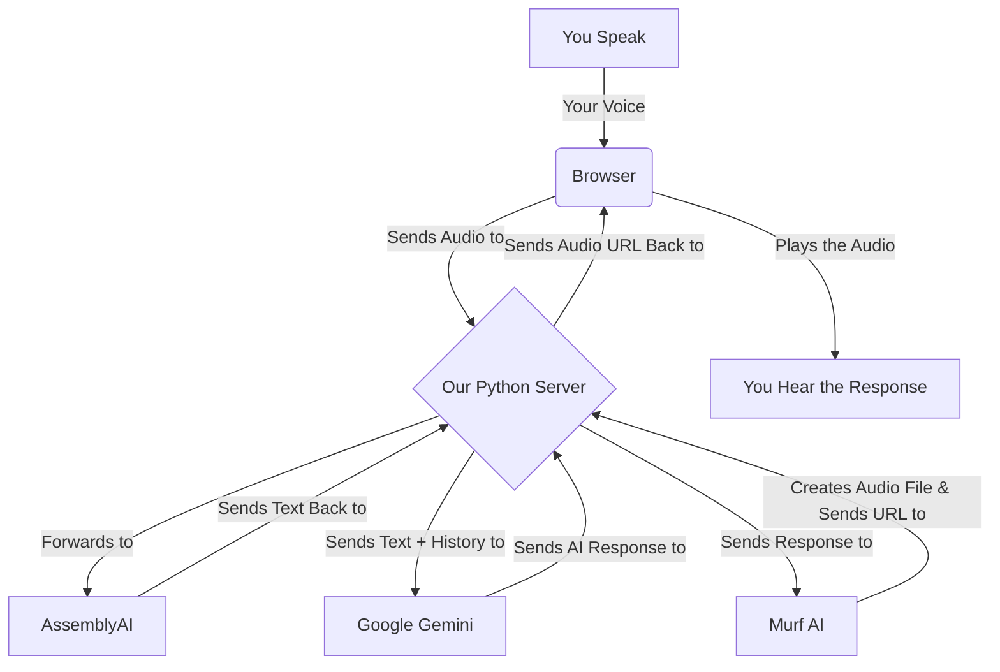

<div align="center">

# 🎙️ VoiceFlow AI

**A proof-of-concept for a fully voice-controlled AI assistant that can remember your conversations.**


</div>

---

This project is a complete, end-to-end conversational agent built to feel like a natural, voice-first experience. It's designed to understand what you say, remember the context of the conversation, and respond with a synthesized voice, all in real time.

---

## ✨ What It Can Do

- **Full Voice Conversations:** You can talk to it, and it talks back! The whole experience is driven by your voice, from asking a question to hearing the answer.
- **It Remembers What You Said:** The assistant keeps track of the conversation, so you can ask follow-up questions naturally without having to repeat yourself.
- **Pick Up Where You Left Off:** You can close the browser and come back to a conversation later just by using the session's unique URL.
- **A Modern, Animated UI:** The interface is designed to be futuristic and intuitive, with animations that show you when the assistant is listening, thinking, or speaking.
- **Handles Errors Gracefully:** If one of the AI services has a problem, the app won't crash. Instead, you'll hear a helpful message letting you know there's an issue.

---

## 🛠️ The Tech Behind It

| Category      | Technology / Service                                       |
|---------------|------------------------------------------------------------|
| **Backend** | Python, FastAPI                                            |
| **Frontend** | HTML, CSS, JavaScript                                      |
| **AI Services** |                                                            |
| ↳ Language Model | [Google Gemini](https://aistudio.google.com/)            |
| ↳ Speech-to-Text | [AssemblyAI](https://www.assemblyai.com/)                |
| ↳ Text-to-Speech | [Murf AI](https://murf.ai/)                              |

---

## 🚀 How to Get It Running

Here’s how to get a copy of the project running on your own machine.

### What You'll Need

- Python 3.8 or newer.
- API keys from Murf AI, AssemblyAI, and Google AI Studio.

### Installation and Setup

1.  **Clone the Repository**
    ```sh
    git clone [[text](https://github.com/Ayu-shTiwari/VoiceAgent.git)](https://github.com/Ayu-shTiwari/VoiceAgent.git)
    cd voiceflow-ai
    ```

2.  **Set Up a Virtual Environment**
    ```sh
    # On macOS or Linux
    python3 -m venv venv
    source venv/bin/activate

    # On Windows
    python -m venv venv
    .\venv\Scripts\activate
    ```

3.  **Install the Dependencies**
    ```sh
    pip install -r requirements.txt
    ```

4.  **Set Up Your API Keys**
    - Create a file named `.env` in the main project folder.
    - Add your API keys to this file like so:
      ```env
      MURF_API_KEY="your_murf_api_key_here"
      ASSEMBLYAI_API_KEY="your_assemblyai_api_key_here"
      GEMINI_API_KEY="your_gemini_api_key_here"
      ```

### Running the App

1.  **Start the Server**
    ```sh
    uvicorn app:app --reload
    ```

2.  **Open in Your Browser**
    - Go to `http://127.0.0.1:8000`, and you should see the app running.

---

## 🗺️ How It Works

Here’s a quick look at the journey your voice takes when you use the app:


