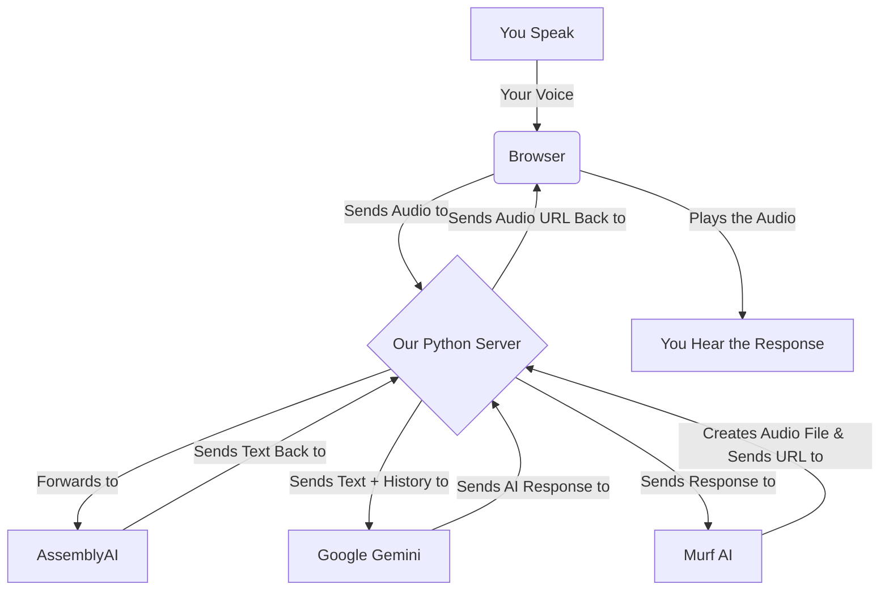

# 🎙️ VoiceFlow AI : Your Personalised Chat Bot 
-><b>WITH SOME PERSONALITY TWIST<-

##
**A proof-of-concept for a fully voice-controlled AI assistant that can remember your conversations.**


## Project Demo

🎬 **Demo Video:** [demo.mp4](https://ayu-shtiwari.github.io/VoiceFlow)

> The `demo.mp4` file demonstrates the SeekReality platform in action, showing the process of uploading media and detecting deepfakes in real time.

[Try VoiceFlow Live](https://voiceflow-o1.onrender.com) 
---

<div align="center">

## 🌟 Features


</div>

---

This project is a complete, end-to-end conversational agent built to feel like a natural, voice-first experience. It's designed to understand what you say, remember the context of the conversation, and respond with a synthesized voice, all in real time.

---

### Core Capabilities
- **Voice-to-Voice Conversations**: Speak naturally and receive AI responses in Murf AI's natural voice
- **Persistent Chat History**: AI remembers previous conversations across sessions
- **Real-time Transcription**: Convert speech to text using AssemblyAI
- **Intelligent Responses**: Powered by Google Gemini API with special persona.
- **Special Skills Integration**: Includes web search and news fetching capabilities to  enhance responses
- **Modern UI**: Glass-morphism design with smooth animations
- **Error Handling**: Graceful fallbacks when APIs are unavailable

### Technical Features
- **FastAPI Backend**: Modern, async Python web framework
- **Session Management**: Unique conversation sessions via URL parameters
- **Audio Processing**: Record and high speed processing of audio files
- **Multi-API Integration**: Seamless integration with multiple AI services
- **WebSocket Streaming**: Real-time audio streaming and transcription with AssemblyAI and Murf WebSocket services
- **Responsive Design**: Works on desktop and mobile devices

---

## 🛠️ The Tech Behind It

| Category             | Technology / Service                                     |
|----------------------|----------------------------------------------------------|
| **Backend**          | Python, FastAPI                                          |
| **Frontend**         | HTML, CSS, JavaScript                                    |
| **AI Services**      |                                                          |
|     ↳ Language Model | [Google Gemini](https://aistudio.google.com/)            |
|     ↳ Speech-to-Text | [AssemblyAI](https://www.assemblyai.com/)                |
|     ↳ Text-to-Speech | [Murf AI](https://murf.ai/)                              |
| **llm Skills**       |                                                          |
|     ↳ Web Search Service & News Service using Tavily SDK(Tavily-Client)
|     ↳ Weather update using OpenweatherMap API
| **Templates**        |Jinja2        
| **Styling**          |Modern CSS with glass-morphism effects                    |
| **WebSocket**        |Real-time audio streaming and TTS via Murf WebSocket      |

---

### Project Structure
```
The project is organized into a clean, maintainable structure that separates concerns.
/voiceflow-ai
|
|-- /schemas                          # Pydantic models for API data structures 
|   |-- chat_schemas.py
|
|-- /services                         # Modules for external AI services (STT, LLM, TTS)
|   |-- assembly_service.py
|   |-- streaming_llm.py
|   |-- murf_service.py 
|   |-- config_service.py
|   |-- /llm_skills
|       |-- tavily.py
|       |-- weather.py
|
|-- /static                           # Frontend assets
|   |-- script.js
|   |-- recorder-processor.js
|   |-- style.css
|   |-- fallback_audio.mp3
|   |-- background.jpg 
|   |-- favicon.ico
|
|-- /templates 
|   |-- index.html                     # Main HTML file
|
|-- .env                              # For storing API keys
|-- .gitignore                        # For git purpose
|-- api_keys.json                     # For storing user Api's
|-- app.py                            # The main FastAPI server
|-- chat_history.json                 # Stores conversation history
|-- requirements.txt                  # Python dependencies
`-- README.md                         # This file
```


## 🚀 How to Get It Running

Here’s how to get a copy of the project running on your own machine.

### What You'll Need

- Python 3.8 or newer.
- pip (Python package manager)
- API keys from Murf AI, AssemblyAI, Google AI Studio.
- For skill usage get API keys from Tavily, OpenWeatherMap

### Installation and Setup

1.  **Clone the Repository**
    ```sh
    git clone https://github.com/Ayu-shTiwari/VoiceAgent.git
    cd voiceflow-ai
    ```

2.  **Set Up a Virtual Environment**
    ```sh
    # On macOS or Linux
    python3 -m venv venv
    source venv/bin/activate

    # On Windows
    python -m venv venv
    .\venv\Scripts\activate
    ```

3.  **Install the Dependencies**
    ```sh
    pip install -r requirements.txt
    ```

4.  **Set Up Your API Keys For Usage** 
    - Create a file named `.env` in the main project folder.
    - Add your API keys to this file like so:
    ```env
      MURF_API_KEY="your_murf_api_key_here"
      ASSEMBLYAI_API_KEY="your_assemblyai_api_key_here"
      GEMINI_API_KEY="your_gemini_api_key_here"
      TAVILY_API_KEY="your_tavily_api_key"
      WEATHER_API_KEY="your_openWeatherMap_api_key"
    ```

### Running the App

1.  **Start the Server**
    ```sh
    uvicorn app:app --reload
    ```

2.  **Open in Your Browser**
    - Go to `http://127.0.0.1:8000`, and you should see the app running.

---

## 🗺️ How It Works

Here’s a quick look at the journey your voice takes when you use the app:


```mermaid
graph TD
    A[You Speak] -->|Your Voice| B(Browser);
    B -->|Sends Audio to| C{Our Python Server};
    C -->|Forwards to| D[AssemblyAI];
    D -->|Sends Text Back to| C;
    C -->|Sends Text + History to| E[Google Gemini];
    E -->|Sends AI Response to| C;
    C -->|Sends Response to| F[Murf AI];
    F -->|Creates Audio File & Sends URL to| C;
    C -->|Sends Audio URL Back to| B;
    B -->|Plays the Audio| G[You Hear the Response];
```
## 📖 Usage Guide
- **API_Keys Configuration:** Validate your keys first to unlock chat Session.
- **Starting a Conversation:** Click the microphone button to start recording, speak your message.
- **New Session:** Click the "New Chat" button in the top-right corner config button to start a fresh conversation.
- **Continue a Session:** Simply use the URL with the `session_id` in it to pick up a conversation where you left off or you can look for that session in left sidebar.

#### Session Management
- **New Session**: Visit `http://localhost:8000` for a new conversation
- **Continue Session**: Use `http://localhost:8000/?session_id=your-session-id` to continue previous conversations

---
## 🔧 Configuration

### Environment Variables
     All required API keys should be set in your `.env` file:
```bash
# Required - Get from respective service websites
MURF_API_KEY=your_key_here
GEMINI_API_KEY=your_key_here
ASSEMBLYAI_API_KEY=your_key_here
TAVILY_API_KEY=your_tavily_api_key
WEATHER_API_KEY=your_openWeatherMap_api_key

```
### API Key Sources
- **Murf AI**: [Murf Key](https://murf.ai)
- **Google Gemini**: [Google Gemini Key](https://makersuite.google.com/app/apikey)
- **AssemblyAI**: [Assembly Key](https://www.assemblyai.com)
- **Tavily**: [Tavily Key](https://app.tavily.com/home)
- **Weather**: [OpenWeatherMap Key](https://openweathermap.org/api)


## 🐛 Troubleshooting

### Common Issues

**1. API Key Errors**
- Ensure all API keys are configured.
- Check API key validity and quota limits

**2. Microphone Access**
- Ensure browser has microphone permissions
- Check if HTTPS is required for microphone access

**3. Audio Playback Issues**
- Check browser console for JavaScript errors
- Ensure audio format compatibility (MP3/WAV)